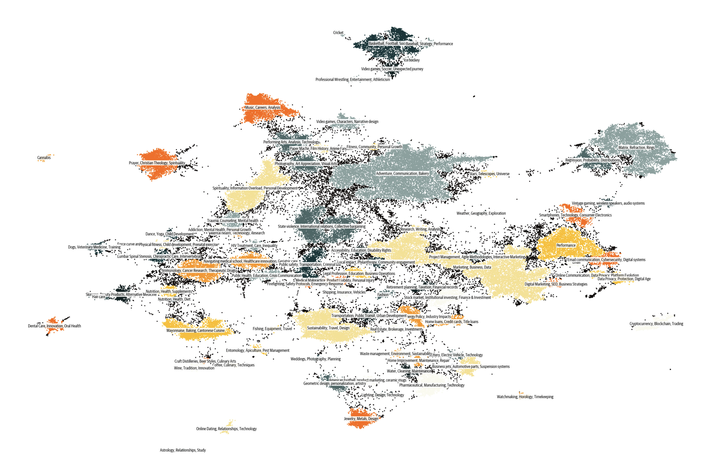

# Cosmopedia

    
    
Image generated by DALL-E, the <a href="https://huggingface.co/datasets/HuggingFaceTB/miscellaneous/blob/main/cosmopedia_dalle_prompt_by_mixtral.txt">prompt</a> was generated by Mixtral-8x7B-Instruct-v0.1.

<a href="https://huggingface.co/datasets/HuggingFaceTB/cosmopedia">[🤗 Cosmopedia dataset]</a> | <a href="https://huggingface.co/HuggingFaceTB/cosmopedian-1b">[🤖 1B-LLM trained on Cosmopedia]</a> 

## Description
Here you can find the code used for creating [Cosmopedia](https://huggingface.co/datasets/HuggingFaceTB/cosmopedia), a dataset of synthetic textbooks, blogposts, stories, posts and WikiHow articles generated by Mixtral-8x7B-Instruct-v0.1. It contains over **30 million files and 25 billion tokens**, making it the largest open synthetic dataset to date.

Cosmopedia covers a variety of topics; we tried to map world knowledge present in Web datasets like RefinedWeb and RedPajama, and generate synthetic content that covers them. This is the v0.1 of Cosmopedia, with ample room for improvement and topics to be more comprehensively covered. We hope this dataset will help the community's research efforts in the increasingly intriguing domain of synthetic data.

    
    
The clusters of Cosmopedia.

You can also find a files frequency plot of single topic clusters in `plots/topic_distpng.png`.

## Code structure
- `prompts`: the code for building the prompts in each `seed_data` in Cosmopedia.
- `generation`: the code to run large scale synthetic generationswith [llm-swarm](https://github.com/huggingface/llm-swarm) using the prompts you built. Cosmopedia consists of 25B tokens and was generated in ~16k H100 GPU hours.
- `deduplication`: the script we used to run MinHash deduplication with [datatrove](https://github.com/huggingface/datatrove).
- `decontamination`: the code we used to run n-gram decontamination against evaluation benchmarks, when training models on the dataset like [cosmopedian-1b](https://huggingface.co/HuggingFaceTB/cosmopedian-1b). 
